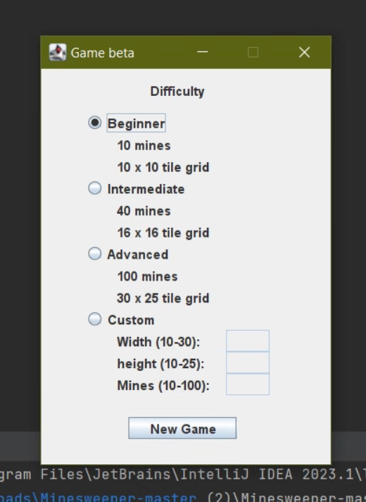
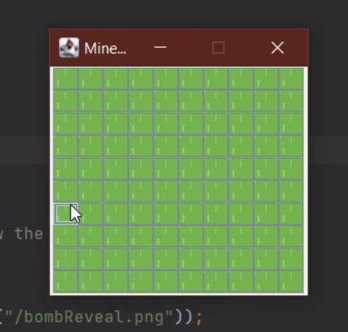
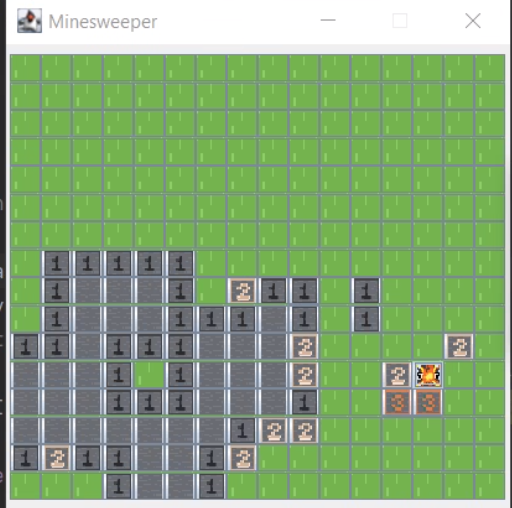
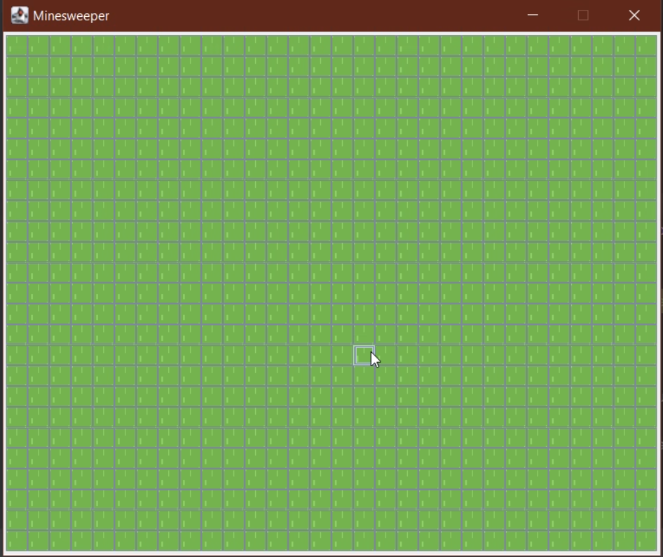
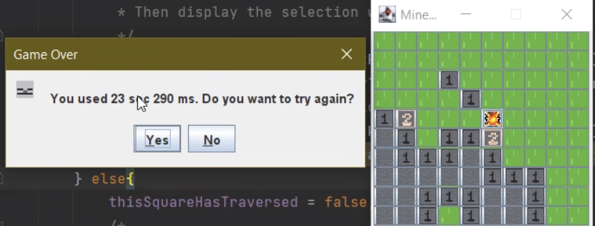
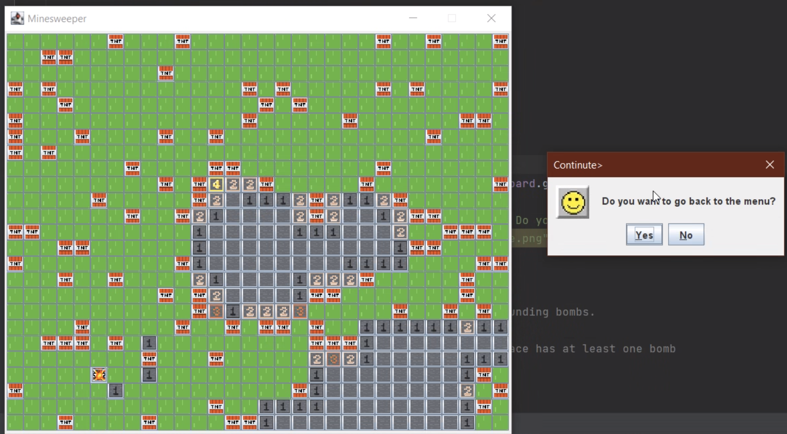

# Minesweeper For DSA
## Introduction
This is the Team 30 FLOP Minesweeper DSA final project. Minesweeper is a puzzle game that consists of a grid of cells, where some of the cells contain hidden “mines”. Furthermore, we also build a extra mini game called whack-a-mole for relaxing purposes.

## Documentation
### How to play:
- **Left mouse**: start a game. Then based on the numbers you see, you have to figure out where the mines are and secure them with flags, and discover more numbers to find even more mines.
- **Right mouse**: mark a field with flag.
### Features:
- Completed: 
    - Custom a bunch of map (beginner, intermediate, advanced).
    - Turn back the previous step if click on mine.
    - Build whack a mole (mini game)
- Future plans: 
    - Register/ Login Feature.
    - Show top 10 scores for selected difficult level.
## Screenshots 
### Minesweeper Screenshots
| |
|:---:|
| **Configuration Screen**|

| |
|:---:|
| **Beginner Map Screen**|

| |
|:---:|
| **Intermediate Map Screen**|

| |
|:---:|
| **Advanced Screen Screen**|

| |
|:---:|
| **Game Over Popup**|

| |
|:---:|
| **Congratulation Popup**|

| |
|:---:|
| **Back To Menu Popup**|
## Tech stacks
- Language: [JAVA](https://www.java.com/en/)
- IDEA: [IntelliJ](https://www.jetbrains.com/idea/)
- Library: [JavaSwing](https://en.wikipedia.org/wiki/Swing_(Java)) and [JavaAWT](https://en.wikipedia.org/wiki/Abstract_Window_Toolkit)
## Contributing
| Order |          Name          |     ID      |                Task                | Contribution |
| :---: |:----------------------:|:-----------:|:----------------------------------:|:------------:|
|   1   | Trịnh Đức Bảo (leader) | ITITIU20134 | Github manager, project management |     20%      |
|   2   |  Trần Huỳnh Nhật Thi   | ITITIU20311 |     Fix bug, provide new idea      |     20%      |
|   3   |     Vĩnh Bảo Phúc      | ITITIU20127 |   Mini game manager, powerpoint    |     20%      |
|   4   |    Lê Kỳ Quốc Bình     | ITITIU20169 |   Graphics and resource manager    |     20%      |
|   4   |     Trần Minh Huy      | ITITIU20219 |     Report management, tester      |     20%      |
