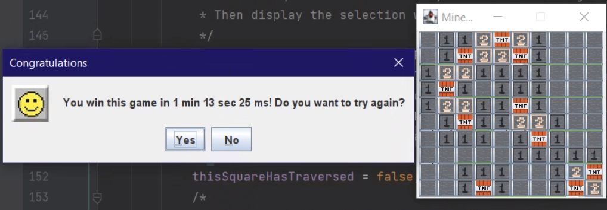

# Minesweeper For DSA
## Introduction
This is the Team 30 FLOP Minesweeper DSA final project. Minesweeper is one of the most popular games in the world. Also we have a mini-game project called whack-a-mole that can help you to relax.

## Documentation
### Features:
- Completed: Custom game map, Whack a mole (mini game), stop, restart.
- Future plans: Boss, Shop which can change the custom of pacman.
## Screenshots 
### Minesweeper Screenshots
| |
|:---:|
| **Configuration Screen**|

| |
|:---:|
| **Beginner Map Screen**|

| |
|:---:|
| **Intermediate Map Screen**|

| |
|:---:|
| **Advanced Screen Screen**|

| |
|:---:|
| **Game Over Popup**|

| |
|:---:|
| **Congratulation Popup**|

| |
|:---:|
| **Back To Menu Popup**|
## Tech stacks
- Language: [JAVA](https://www.java.com/en/)
- IDEA: [IntelliJ](https://www.jetbrains.com/idea/)
- Library: [JavaSwing](https://en.wikipedia.org/wiki/Swing_(Java)) and [JavaAWS](https://en.wikipedia.org/wiki/Abstract_Window_Toolkit)
## Contributing
| Order |          Name          |     ID      |                Task                | Contribution |
| :---: |:----------------------:|:-----------:|:----------------------------------:|:------------:|
|   1   | Trịnh Đức Bảo (leader) | ITITIU20134 | Github manager, project management |     20%      |
|   2   |  Trần Huỳnh Nhật Thi   | ITITIU20311 |     Fix bug, provide new idea      |     20%      |
|   3   |     Vĩnh Bảo Phúc      | ITITIU20127 |   Mini game manager, powerpoint    |     20%      |
|   4   |    Lê Kỳ Quốc Bình     | ITITIU20169 |   Graphics and resource manager    |     20%      |
|   4   |     Trần Minh Huy      | ITITIU20219 |     Report management, tester      |     20%      |
